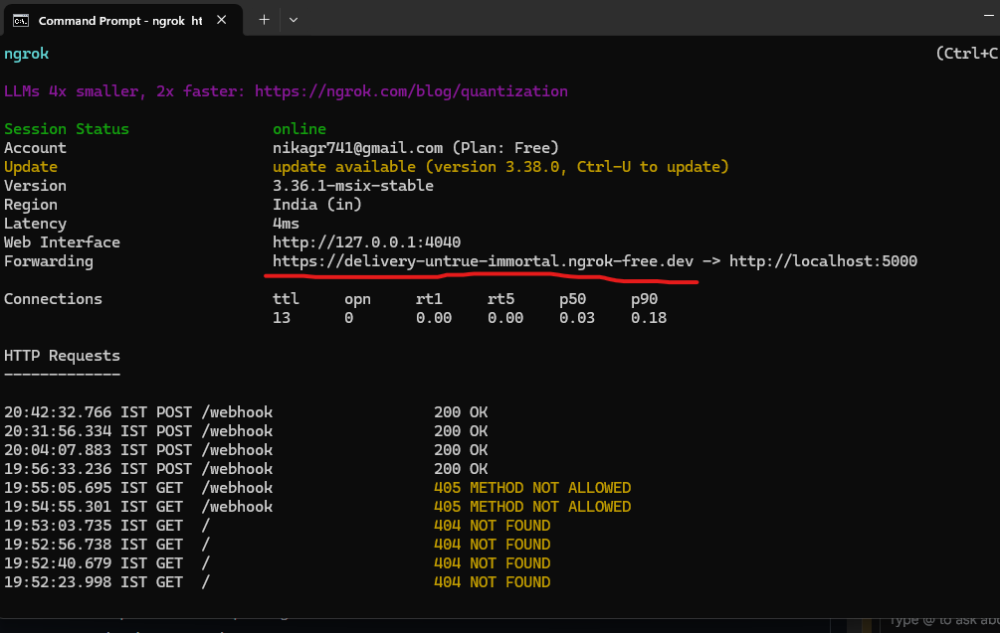
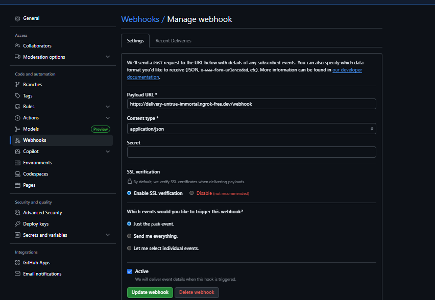

# 🚀 GitHub Webhook Integration with Python

A lightweight application that demonstrates how to receive and process real-time events from GitHub using Python, Flask, and ngrok.

## 📌 Project Overview
This project serves as a **"Reverse API."** Instead of our app asking GitHub if anything has changed, GitHub **pushes** data to our app the moment a "Push" event occurs.

### Tech Stack
* **Python 3.x**
* **Flask**: Web server to handle incoming HTTP POST requests.
* **ngrok**: Secure tunnel to expose localhost to the internet.

---

## 🛠️ Step 1: Local Setup

### 1. Install Dependencies
```bash
pip install flask
```

### 2. The Webhook Receiver (`app.py`)
Create a file named `app.py` and paste the following code:

```python
from flask import Flask, request, jsonify

app = Flask(__name__)

@app.route('/webhook', methods=['POST'])
def handle_webhook():
    data = request.json
    
    # Extracting details from the GitHub payload
    repo_name = data.get('repository', {}).get('full_name')
    pusher = data.get('pusher', {}).get('name')
    commit_msg = data.get('head_commit', {}).get('message')

    print("\n--- New GitHub Event Received! ---")
    print(f"Repo: {repo_name}")
    print(f"Pushed by: {pusher}")
    print(f"Commit Message: {commit_msg}")

    return jsonify({"status": "success"}), 200

if __name__ == '__main__':
    app.run(port=5000)
```

---

## 🌐 Step 2: Deployment & Git Configuration

### 1. Fix Remote URL (Common Error)
If you get a `Could not resolve host` error, fix your remote URL by adding the missing forward slash:
```bash
git remote set-url origin [https://github.com/nikagr741/DemoProjects.git](https://github.com/nikagr741/DemoProjects.git)
```

### 2. Authentication
GitHub requires a [Personal Access Token (Classic)](https://github.com/settings/tokens) for command-line access. 
* Use your username: `nikagr741`
* Use your **Token** as the password when pushing.
* *Note:* Your current token is set to expire on **May 26, 2026**.

### 3. Expose Localhost with ngrok
To let GitHub send data to your local machine:
1. Start your Flask app: `python app.py`
2. Run ngrok: `ngrok http 5000`
3. Copy the **Forwarding URL** (e.g., `https://your-id.ngrok-free.app`).


---

## 🧪 Step 3: Configure GitHub Webhook
1. Go to your repo: **Settings > Webhooks > Add webhook**.
2. **Payload URL:** Paste your ngrok URL + `/webhook`.
3. **Content type:** Select `application/json`.
4. Click **Add webhook**.

## ✅ Testing the Integration
Push a change to your repo:
```bash
git add .
git commit -m "Testing real-time webhook"
git push origin main
```
Your Python terminal will instantly log the commit details!
```

---

Do you want to add a section on how to handle multiple types of events (like Issues or Pull Requests) as well?